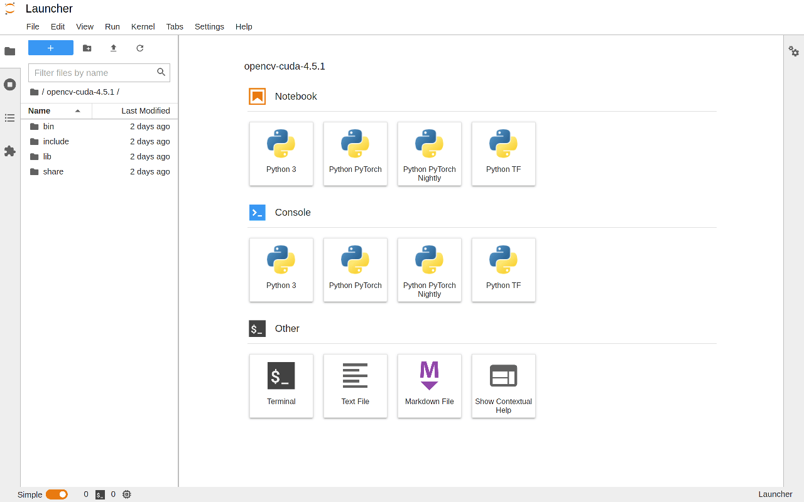

# Install TensorFlow and JupyterLab

## Ubuntu

- [Ubuntu 18.04.5 LTS (Bionic Beaver)](http://releases.ubuntu.com/bionic/)
  - ubuntu-18.04.5-desktop-amd64.iso

<!--
- https://wiki.ubuntu.com/Releases
-->

## CUDA

- [CUDA 11.2.2](https://developer.nvidia.com/cuda-toolkit)
  - cuda_11.2.2_460.32.03_linux.run
- [cuDNN 8.1.1](https://developer.nvidia.com/cudnn)
  - libcudnn8_8.1.1.33-1+cuda11.2_amd64.deb
  - libcudnn8-dev_8.1.1.33-1+cuda11.2_amd64.deb
  - libcudnn8-samples_8.1.1.33-1+cuda11.2_amd64.deb

## Anaconda

- [Anaconda Python 3.8](https://www.anaconda.com/products/individual#Downloads)
  - Anaconda3-2020.11-Linux-x86_64.sh

<!--
- 北外镜像源: https://mirrors.bfsu.edu.cn/help/anaconda/
-->

## JupyterLab

```bash
conda activate base
conda install -c conda-forge jupyterlab
```

## TensorFlow

```bash
# create virtual environment
conda create -n tf python=3.8 -y
conda activate tf

# install tensorflow
pip install --upgrade pip
pip install tensorflow
```

Test:

```bash
$ python - <<EOF
import tensorflow as tf
print(tf.__version__, tf.test.is_built_with_gpu_support())
print(tf.config.list_physical_devices('GPU'))
EOF
```

### Solution: Could not load dynamic library 'libcusolver.so.10'

```bash
cd /usr/local/cuda/lib64
sudo ln -sf libcusolver.so.11 libcusolver.so.10
```

## IPython kernel

```bash
conda activate tf
conda install ipykernel -y
python -m ipykernel install --user --name tf --display-name "Python TF"
```

Run JupyterLab:

```bash
conda activate base
jupyter lab
```

Open http://localhost:8888/ :



## References

- [Install TensorFlow 2](https://www.tensorflow.org/install)
  - [Build from source](https://www.tensorflow.org/install/source)
  - [GPU support](https://www.tensorflow.org/install/gpu)
- [Install TensorFlow - Anaconda](https://docs.anaconda.com/anaconda/user-guide/tasks/tensorflow/)
  - [anaconda / packages / tensorflow](https://anaconda.org/anaconda/tensorflow)
